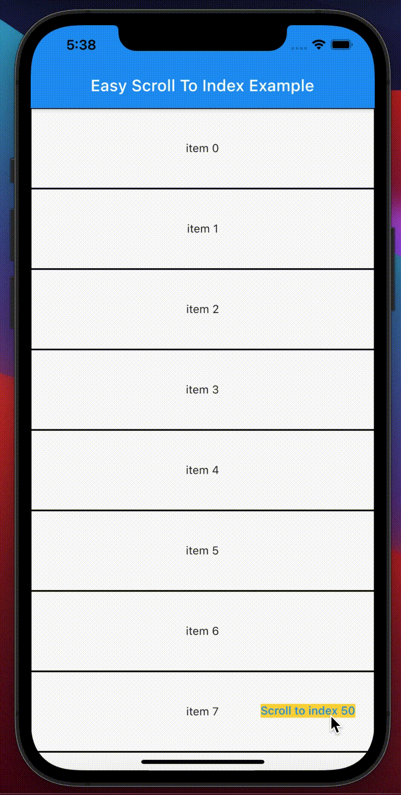

# easy_scroll_to_index

A new Flutter package support scroll to index for Listview, Gridview and NestedScrollView

### Demo

|   |   |   |
|---|---|---|
| |


Example:

### Display on UI

To display on UI, currently you can use `EasyScrollToIndex`.

Example:
```     
            final ScrollToIndexController _controller = ScrollToIndexController();

            EasyScrollToIndex(
              controller: _controller,
              itemCount: 100,
              width: 50,
              height: 100,
              itemBuilder: (BuildContext context, int index) {
               return Container(
                 width: 50,
                 height: 100,
                  decoration: BoxDecoration(
                    border: Border.all(color: Colors.black,width: 1),
                  ),
                  child: Center(child: Text('item '+ index.toString())),
                );
              },
            ),

```


